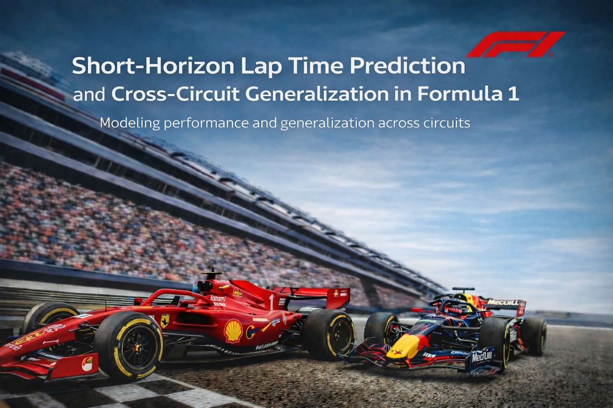

# Formula 1 Lap Time Prediction

**Machine Learning–Based Modeling of Race Performance**



---

## Overview

This project studies lap time prediction in Formula 1 using machine learning models trained on telemetry, weather, and circuit data from the 2023–2025 seasons. The goal is to understand which modeling approaches generalize across circuits and which features drive performance.

Two complementary modeling settings are explored:
- **Per-race models** — trained and evaluated within a single race
- **Per-circuit models** — trained on multiple circuits and tested on unseen ones

The latter represents the more realistic and challenging prediction task.

---

## Research Questions

This work addresses two complementary prediction problems:

### 1. Within-Race Prediction

*Can lap times be accurately predicted within a single race when full contextual information is available?*

This setting assumes knowledge of the circuit, drivers, and race conditions. It represents an upper bound on achievable performance and measures how well short-term lap dynamics can be modeled.

### 2. Cross-Circuit Generalization

*Can lap time dynamics be predicted on circuits not seen during training?*

This setting removes circuit-specific information and evaluates whether models can generalize across tracks, capturing transferable relationships rather than memorizing track characteristics.

---

## Table of Contents

1. [Data Sources](#data-sources)
2. [Feature Engineering](#feature-engineering)
3. [Modeling Setup](#modeling-setup)
4. [Results](#results)
5. [Key Findings](#key-findings)
6. [Project Structure](#project-structure)
7. [Requirements](#requirements)
8. [Usage](#usage)

---


## Data Sources

- **[FastF1](https://github.com/theOehrly/Fast-F1)** — Official telemetry, lap times, weather, and timing data
- **[OpenF1 API](https://openf1.org/)** — Pit stops, stints, race control events
- **[F1DB](https://github.com/f1db/f1db)** — Circuit geometry and historical metadata

**Coverage**: 2023–2025 Formula 1 seasons 

**Note**: The `cache/` folder (~several GB) is not included in this repository. It can be regenerated by running `utilities_dataset.ipynb`.

---

## Feature Engineering

Features are built at the lap level and grouped into four categories:

### Tyre & Stint
- Compound (SOFT, MEDIUM, HARD)
- Tyre age and stint length
- New tyre indicator

### Race State
- DRS availability and traffic conditions
- Race position and gaps
- Clean/dirty air indicators

### Weather
- Air and track temperature
- Wind speed and direction (trigonometric encoding)
- Humidity and pressure

### Circuit Geometry *(per-circuit models only)*
- Number of turns and braking zones
- Straight lengths and DRS zones
- Corner angles and speed profiles

**Target variable**: Next-lap time 

---

## Modeling Setup

### Per-Race Models
- **Objective**: Predict lap times within a single race
- **Split**: Time-ordered 70/15/15 within each (driver, stint) group
- **Models**: Linear Regression, Ridge Regression
- **Features**: Tyre, Weather, Race State, Driver/Team identifiers
- **Use Case**: Race strategy optimization with full contextual information

### Per-Circuit Models
- **Objective**: Generalize to unseen circuits
- **Split**: Circuit-disjoint (15 train / 4 validation / 5 test circuits)
- **Models**: Linear (Ridge, ElasticNet), Nonlinear (Decision Tree, Random Forest, Hist Gradient Boosting, CatBoost)
- **Features**: Tyre, Weather, Race State, Circuit Geometry
- **Validation**: GroupKFold cross-validation grouped by circuit
- **Use Case**: Pre-season predictions for new or modified circuits

---

## Results

### 1. Per-Race Models (Known Circuits)

| Model | Features | Test MAE (s) | Test RMSE (s) | Test R² |
|-------|----------|--------------|---------------|---------|
| Linear | Tyre + Stint | 0.6506 | 0.8413 | 0.9929 |
| Linear | Tyre + Stint + Weather | 0.7012 | 0.9254 | 0.9914 |
| Linear | Full (No Driver/Team) | 0.6102 | 0.8146 | 0.9933 |
| **Ridge (α=1.0)** | **Full + Driver/Team** | **0.4199** | **0.5768** | **0.9966** |

Per-race prediction is extremely accurate, driven largely by driver- and team-specific effects.

---

### 2. Per-Circuit Models (Unseen Circuits)

#### Linear & Regularized Models

| Model | Features | MAE (s) | RMSE (s) | R² |
|-------|----------|---------|----------|-----|
| Linear | Tyre + Weather | 0.468 | 0.656 | -0.21 |
| Linear | Tyre + Weather + State | 0.365 | 0.521 | 0.239 |
| Ridge (α=5000) | Tyre + Weather + State | 0.375 | 0.527 | 0.222 |

#### Nonlinear Models

| Model | Features | MAE (s) | RMSE (s) | R² |
|-------|----------|---------|----------|-----|
| **Random Forest** | **Tyre + Weather + State** | **0.335** | **0.486** | **0.338** |
| **Random Forest** | **+ Geometry** | **0.333** | **0.484** | **0.342** |
| Hist. Gradient Boosting | Tyre + Weather + State | 0.335 | 0.499 | 0.302 |

---

## Key Findings

- **Per-race models** achieve near-perfect accuracy (R² ≈ 0.997) but rely heavily on driver and circuit identity
- **Per-circuit generalization** is significantly harder and exposes model limitations
- **Tree-based ensemble models** (Random Forest, Hist. Gradient Boosting) outperform linear approaches when generalizing
- **Geometry features** improve performance for nonlinear models but degrade linear ones (multicollinearity)
- **CatBoost** showed strong training performance but poor generalization (overfitting)
- **Driver/Team effects** are powerful within-race predictors but do not transfer across circuits

**Best model for cross-circuit generalization**: Random Forest with Tyre + Weather + State + Geometry features (MAE = 0.33s, R² = 0.34)

---

## Project Structure

```
.
├── cache/                          # FastF1 raw data (not included, ~several GB)
├── csv_output/                     # Processed datasets and model outputs
│   ├── Filtered_Data/              # Final cleaned datasets
│   ├── nonlinear/                  # Model results (JSON/CSV)
│   ├── Train_set.xlsx              # Circuit-disjoint splits
│   ├── Validation_set.xlsx
│   └── Test_set.xlsx
├── figures/                        # Plots and visualizations
├── Formula1_dataset.ipynb          # Data extraction from FastF1
├── Data_cleaning_and_feat_eng.ipynb  # Feature engineering & cleaning
├── Linear.ipynb                    # Linear models (Ridge, ElasticNet)
├── Nonlinear.ipynb                 # Nonlinear models (DT, RF, HGB, CatBoost)
├── utilities_dataset.py            # Helper functions
└── README.md
```

---

## Requirements

**Python 3.8+**

```bash
pip install -r requirements.txt
```

Core dependencies:
- `pandas`, `numpy`, `scikit-learn`
- `matplotlib`, `seaborn`
- `fastf1` (F1 data API)
- `catboost` (nonlinear models)
- `jupyter`, `openpyxl`

---

## Usage

### 1. Data Extraction (Optional)
Regenerate the cache from FastF1 (requires several time):

```bash
jupyter notebook utilities_dataset.ipynb
```

### 2. Feature Engineering
Process cache files into structured datasets:

```bash
jupyter notebook Data_cleaning_and_feat_eng.ipynb
```

### 3. Train Models

**Linear models** (per-race and per-circuit):

```bash
jupyter notebook Linear.ipynb
```

**Nonlinear models** (DT, RF, HGB, CatBoost):

```bash
jupyter notebook Nonlinear.ipynb
```

---

## Limitations & Future Work

### Current Limitations
- CatBoost overfits despite good cross-validation scores
- Geometry features hurt linear models (multicollinearity)
- Driver/Team effects don't transfer across circuits


### Future Directions
- Ensemble stacking (combine per-race and per-circuit models)
- Deep learning (LSTM/Transformer for sequential prediction)
- Causal inference (isolate tyre degradation from driver skill)
- Real-time integration with live timing APIs
- Explainability analysis (SHAP values)

---

## Acknowledgments

- **FastF1 Library**: [theOehrly/Fast-F1](https://github.com/theOehrly/Fast-F1)
- **F1 Database**: [f1db/f1db](https://github.com/f1db/f1db)
- **OpenF1 API**: [openf1.org](https://openf1.org/)

---

## License

This project is for educational purposes only. F1 data is property of Formula 1 and is accessed via the FastF1 library under their terms of use.

---

**Author**: Jacopo Sinigaglia  